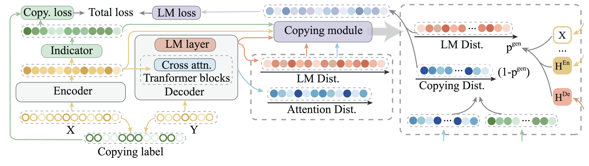

# PROM
Code accompanying the paper **PROM: A Phrase-level Copying Mechanism with Pre-training for Abstractive Summarization** [[pdf]](https://arxiv.org/abs/2305.06647)

Based on the remarkable achievements of pre-trained language models in abstractive summarization, the copying mechanism has proved helpful by improving
the factuality, stability, and overall performance.
This work proposes PROM, a new PhRase-level cOpying Mechanism that enhances attention on $n$-grams, which can be applied to zero-shot summarization with pre-training.
PROM adds an indicator layer to explicitly pick up tokens in $n$-gram that can be copied from the source, and calculates an auxiliary loss for the copying prediction. 
Empirical studies show that PROM makes significant improvements in fine-tuning on benchmarks.
In the zero-shot setting, PROM is utilized in the self-supervised pre-training on raw corpora and provides new general baselines on a wide range of summarization datasets.
Further analysis shows that PROM performs more reasonable copying and contributes to faithfulness. 



Accepted by COLING2024.

This repo will be improved continually.

- Add checkpoints.

```
@article{ma2023prom,
  title={PROM: A Phrase-level Copying Mechanism with Pre-training for Abstractive Summarization},
  author={Ma, Xinbei and Gong, Yeyun and He, Pengcheng and Zhao, Hai and Duan, Nan},
  journal={arXiv preprint arXiv:2305.06647},
  year={2023}
}
```
